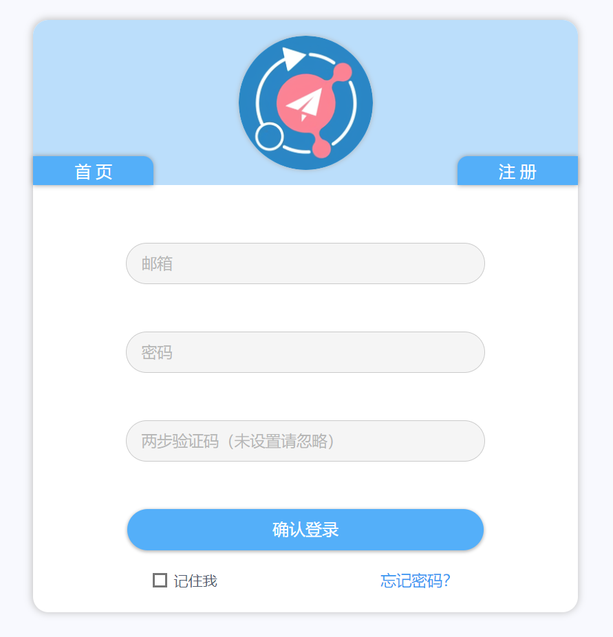
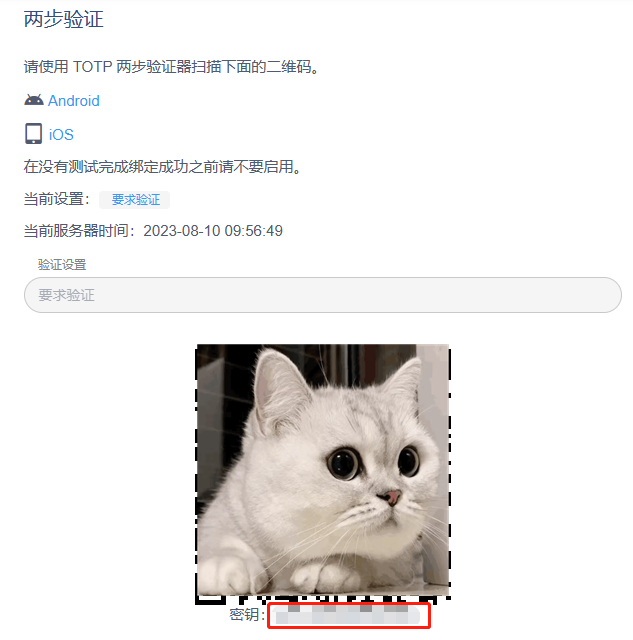
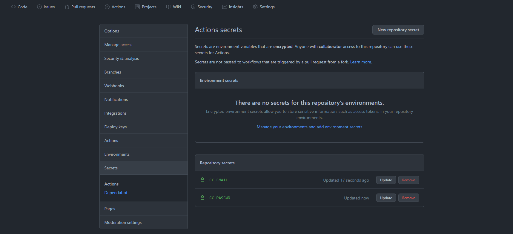
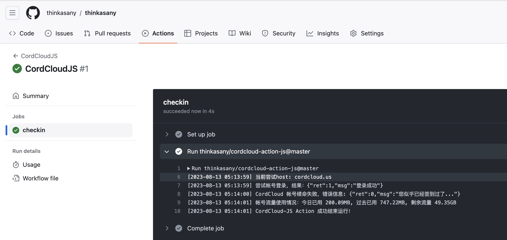

# CordCloud Action


CordCloud 帐号自动续命。可配置 workflow 的触发条件为 `schedule`，实现每日自动签到，领取流量续命。

欢迎 Star ⭐ 关注[本项目](https://github.com/thinkasany/cordcloud-action-js), 本项目是 [cordcloud-action](https://github.com/yanglbme/cordcloud-action) JS 版本的实现，若有体验上的问题，欢迎提交 issues 反馈给我。你也可以将本项目 Fork
到你的个人帐号下，进行自定义扩展。

## 入参

| 参数     | 描述                   | 是否必传 | 默认值                                                   | 示例                      |
| -------- | ---------------------- | -------- | -------------------------------------------------------- | ------------------------- |
| `email`  | CordCloud 邮箱         | 是       |                                                          | \${{ secrets.CC_EMAIL }}  |
| `passwd` | CordCloud 密码         | 是       |                                                          | \${{ secrets.CC_PASSWD }} |
| `secret` | CordCloud 两步验证密钥 | 否       |                                                          | \${{ secrets.CC_SECRET }} |
| `host`   | CordCloud 站点         | 否       | cordcloud.us,cordcloud.one,<br>cordcloud.biz,c-cloud.xyz |                           |

注：

- `host` 支持以英文逗号分隔传入多个站点，CordCloud Action 会依次尝试每个站点，成功即停止。若是遇到帐号或密码错误，则不会继续尝试剩余站点。
- 如果你设置了两步验证，需要将两步验证的密钥传入，否则无法正常签到。





## 完整示例

### 1. 创建 workflow

在你的任意一个 GitHub 仓库 `.github/workflows/` 文件夹下创建一个 `.yml` 文件，如 `cc.yml`，内容如下：

```yml
name: CordCloudJS

on:
  schedule:
    - cron: "0 0 * * *"
  workflow_dispatch:

jobs:
  checkin:
    runs-on: ubuntu-latest
    steps:
      - uses: thinkasany/cordcloud-action-js@master
        with:
          email: ${{ secrets.CC_EMAIL }}
          passwd: ${{ secrets.CC_PASSWD }}
```

如果你设置了两步验证，需要将两步验证的密钥传入，否则无法完成登录签到。示例如下：

```yml
name: CordCloud

on:
  schedule:
    - cron: "0 0 * * *"
  workflow_dispatch:

jobs:
  checkin:
    runs-on: ubuntu-latest
    steps:
      - uses: yanglbme/cordcloud-action@main
        with:
          email: ${{ secrets.CC_EMAIL }}
          passwd: ${{ secrets.CC_PASSWD }}
          secret: ${{ secrets.CC_SECRET }}
```

注意：`cron` 是 UTC 时间，使用时请将北京时间转换为 UTC 进行配置。由于 GitHub Actions 的限制，如果将 `cron` 表达式设置为 `* * * * *`，则实际的执行频率为每 5 分钟执行一次。

```bash
┌───────────── 分钟 (0 - 59)
│ ┌───────────── 小时 (0 - 23)
│ │ ┌───────────── 日 (1 - 31)
│ │ │ ┌───────────── 月 (1 - 12 或 JAN-DEC)
│ │ │ │ ┌───────────── 星期 (0 - 6 或 SUN-SAT)
│ │ │ │ │
│ │ │ │ │
│ │ │ │ │
* * * * *
```

实际上，一般情况下，你只需要跟示例一样，将 `cron` 表达式设置为**每天定时运行一次**即可。如果担心 CordCloud 官网某次恰好发生故障而无法完成自动签到，可以将 `cron` 表达式设置为一天运行 2 次或者更多次。

### 2. 配置 secrets 参数

在 GitHub 仓库的 `Settings -> Secrets` 路径下配置好 `CC_EMAIL` 与 `CC_PASSWD` ，不要直接在 `.yml` 文件中暴露个人帐号密码以及密钥等敏感信息。

如果你设置了两步验证，注意还需要配置 `CC_SECRET` 参数。



### 3. 每日运行结果

若 CordCloud Action 所需参数 `email`、`passwd` 等配置无误，CordCloud Action 将会根据触发条件（比如 `schedule`）自动运行，结果如下：



```bash
[2023-08-13 13:09:24] 尝试帐号登录，结果：{"ret":1,"msg":"登录成功"}
[2023-08-13 13:09:24] CordCloud 帐号续命失败，错误信息: {"ret":0,"msg":"您似乎已经签到过了..."}
[2023-08-13 13:09:26] 帐号流量使用情况：今日已用 197.81MB, 过去已用 747.22MB, 剩余流量 49.35GB
```
